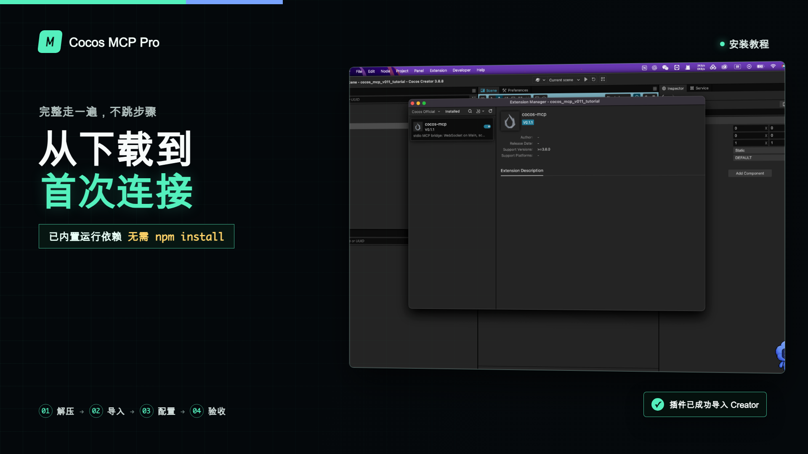
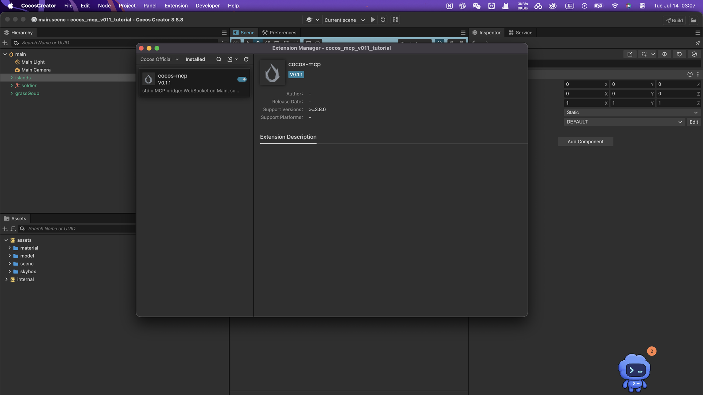

[English](./README.en.md)

# Cocos MCP Pro

让AI更安全地操作Cocos Creator场景：**先读真实层级，再做受控写入；结果可验证，改动可撤销，危险操作有护栏。**

> **不确定你的环境能不能用？** [先看46秒真实撤销证据，并提交购买前兼容性确认](https://go.jimmyjing.dev/compatibility?source=github-prepurchase-compat-v2-20260731)。请带上Creator版本、操作系统、MCP客户端和一个具体任务；不适合我也会直接说明。

[购买Cocos MCP Pro](https://go.jimmyjing.dev/cocos/github/readme) · [观看功能概览](https://www.bilibili.com/video/BV1rVb46JEB8/) · [观看安装教程](https://www.bilibili.com/video/BV1MFb46FEso/)

**当前商店版本：v0.2.0（RC7）。** 当前验收环境为macOS与Cocos Creator 3.8.8；Windows及其他Creator补丁版本未完成同等级验收。v0.3.0候选尚未发布。

**已知问题：**RC7的UI创建请求超时后，Creator仍可能继续执行；超时回执中的`changed:false`不能证明场景没有变化。先核对实际结果，不直接重试或撤销，见[超时处理说明](./docs/FAQ.md#rc7-timeout)。

> 这是Cocos MCP Pro的官方文档、配置示例与公开验收记录仓库。本仓库不包含商业产品核心源码或二进制；开源许可仅适用于明确标注的公开材料。

## 它解决什么

很多Cocos自动化问题并不是“代码写不出来”，而是AI拿错节点、写完没有真正生效、组件下标漂移后误删，或者改坏后很难恢复。

Cocos MCP Pro把工作流收紧为：

1. 读取Creator运行态层级，使用会话短ID（NID）定位目标。
2. 对高频操作执行小步写入，并读取运行态结果作为回执。
3. 删除组件前可用`expectedComponentType`校验类型。
4. 对支持撤销且已核对执行结果和撤销目标的操作，可用`cocos_mcp_undo_last`恢复；未知结果先排查。
5. 失败时用`cocos_diagnose`返回可执行的排查提示。

## 从这里开始

- [Quick Start：从商店ZIP到第一次连接](./docs/QUICK_START.md)
- [故障排查](./docs/TROUBLESHOOTING.md)
- [安全模型](./docs/SECURITY_MODEL.md)
- [工具目录](./docs/TOOL_CATALOG.md)
- [兼容矩阵](./docs/COMPATIBILITY.md)
- [常见问题](./docs/FAQ.md)
- [公开验收记录](./docs/ACCEPTANCE.md)
- [Changelog](./CHANGELOG.md)

## 真实Creator界面

## 公开边界

本仓库接受文档、翻译、脱敏示例和验收说明的PR。核心功能需求请提交Issue，由私有产品仓库排期；由于核心源码不在这里，不接受指向不存在源码的核心实现PR。

需要帮助时，请优先提交带环境信息的Issue。安全问题不要公开披露，请阅读[安全披露说明](./SECURITY.md)。

## 许可

配置模板和公开检查脚本采用MIT许可；文档和公开图片采用CC BY 4.0。`Cocos MCP Pro`名称、Logo与商业源码不在上述授权范围内，详见[商标说明](./TRADEMARKS.md)。
